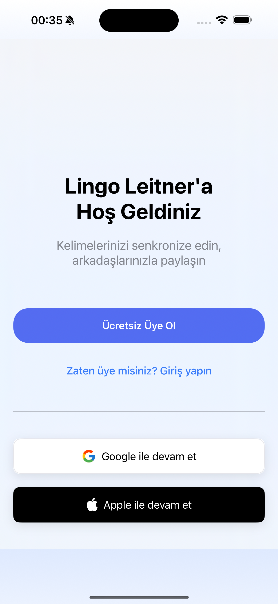
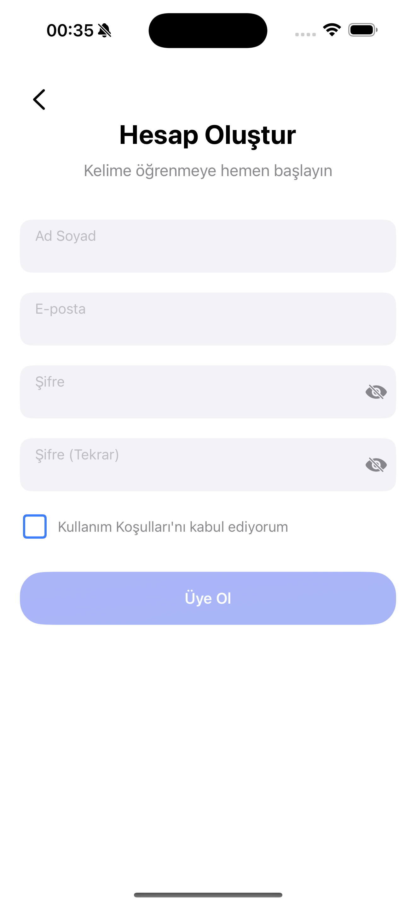
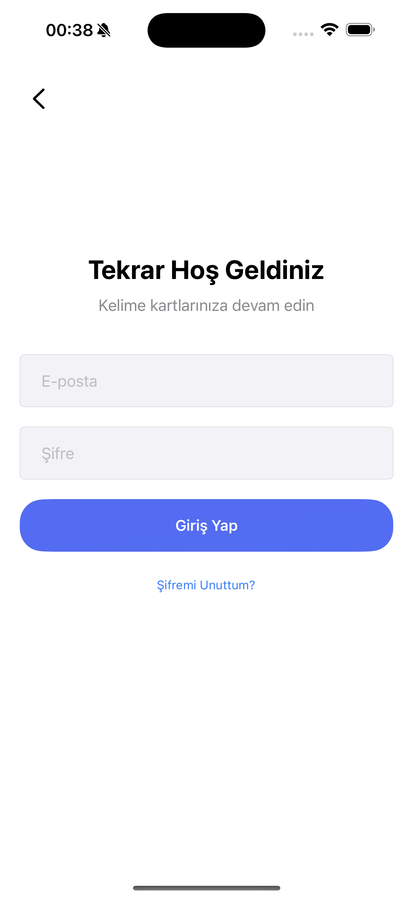
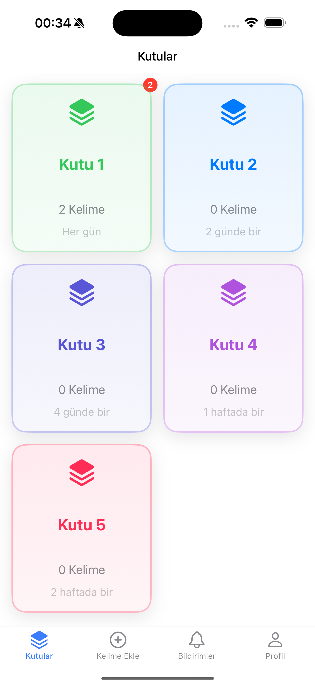
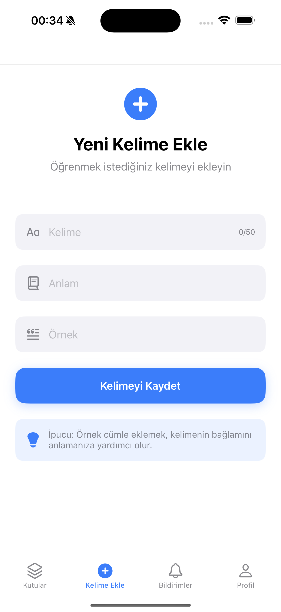
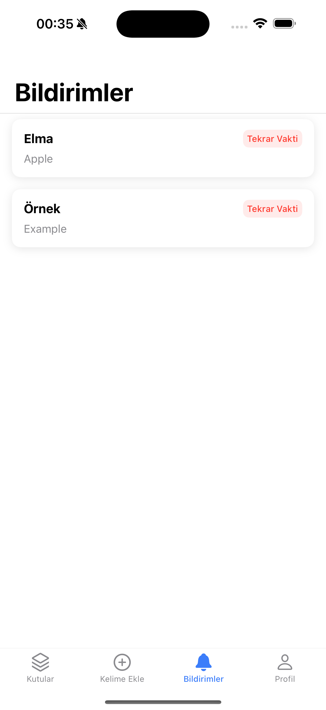
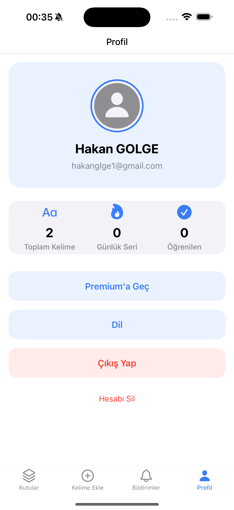
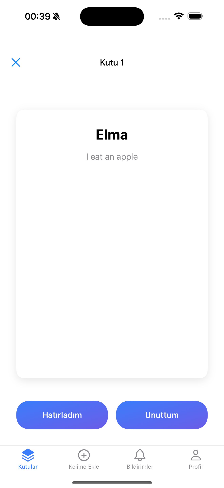

# Lingo Leitner

<div align="center">
  
  
  Lingo Leitner, Leitner sistemini kullanarak yabancı dil öğrenmeyi kolaylaştıran bir iOS uygulamasıdır. Uygulama, kullanıcıların kelime ve deyimleri tekrar kartları (flashcards) yöntemiyle öğrenmesini sağlar.
</div>

## 📱 Ekran Görüntüleri

<div align="center">
  <table>
    <tr>
      <td></td>
      <td></td>
      <td></td>
    </tr>
    <tr>
      <td align="center">Auth</td>
      <td align="center">Sign Up</td>
      <td align="center">Sign In</td>
    </tr>
    <tr>
      <td></td>
      <td></td>
      <td></td>
      <td></td>
      <td></td>
      <td></td>
    </tr>
    <tr>
      <td align="center">Boxes/td>
      <td align="center">Add Word</td>
      <td align="center">Notifications</td>
      <td align="center">Profile</td>
      <td align="center">Purchase</td>
      <td align="center">Flashcard</td>
    </tr>
  </table>
</div>

## 🚀 Özellikler

- 📱 Modern ve kullanıcı dostu arayüz
- 🔄 Leitner sistemi ile akıllı tekrar
- 🎯 Günlük kelime hedefleri
- 📊 İlerleme istatistikleri
- 🔐 Apple ve Google ile güvenli giriş
- ☁️ Firebase ile bulut senkronizasyonu
- 🌙 Karanlık mod desteği

## 📄 Lisans

Bu proje Creative Commons Attribution-NonCommercial-NoDerivs 4.0 International (CC BY-NC-ND 4.0) lisansı altında lisanslanmıştır.

Bu lisans kapsamında:

✅ **Yapabilecekleriniz:**
- Projeyi paylaşabilirsiniz
- Kaynak göstererek alıntı yapabilirsiniz

❌ **Yapamazsınız:**
- Ticari amaçla kullanamazsınız
- Değişiklik yapamazsınız
- Türev çalışmalar oluşturamazsınız

Detaylı bilgi için: [Creative Commons BY-NC-ND 4.0](https://creativecommons.org/licenses/by-nc-nd/4.0/)

## 📋 Gereksinimler

- iOS 15.0+
- Xcode 14.0+
- Swift 5.0+
- CocoaPods

## 🛠 Kurulum

1. Projeyi klonlayın:
```bash
git clone https://github.com/yourusername/Lingo-Leitner.git
cd Lingo-Leitner
```

2. CocoaPods bağımlılıklarını yükleyin:
```bash
pod install
```

3. Firebase kurulumu:
   - [Firebase Console](https://console.firebase.google.com)'dan yeni bir proje oluşturun
   - iOS uygulaması ekleyin ve `GoogleService-Info.plist` dosyasını indirin
   - İndirilen `GoogleService-Info.plist` dosyasını `Lingo Leitner` klasörüne ekleyin

4. Xcode'da `Lingo Leitner.xcworkspace` dosyasını açın

5. Gerekli sertifikaları ve provizyon profillerini ekleyin

## 👩‍💻 Kullanılan Teknolojiler

### Temel Teknolojiler
- Swift 5
- UIKit
- SwiftUI (Bazı bileşenlerde)
- Combine Framework

### Veritabanı ve Backend
- Firebase Authentication
- Cloud Firestore
- Firebase Storage

### Üçüncü Parti Kütüphaneler
- Alamofire: Ağ istekleri için
- SwiftyJSON: JSON işleme
- GoogleSignIn: Google ile giriş entegrasyonu
- SnapKit: Programmatik UI constraint'leri için

## 📱 Uygulama Mimarisi

- MVVM (Model-View-ViewModel) mimari pattern'i
- Protocol-Oriented Programming
- Dependency Injection
- Repository Pattern (Veri katmanı için)

## 🔐 Güvenlik ve Yapılandırma

Aşağıdaki dosyalar güvenlik nedeniyle repository'de bulunmamaktadır:

- `GoogleService-Info.plist`: Firebase yapılandırması
- `Info.plist`: Uygulama yapılandırması ve hassas bilgiler
- Firebase Yapılandırma Dosyaları:
  - `firestore.rules`: Firestore güvenlik kuralları
  - `firestore.indexes.json`: Firestore indeks yapılandırması
  - `.firebaserc`: Firebase proje yapılandırması
  - `firebase.json`: Firebase genel yapılandırması
  - `database.rules.json`: Realtime Database kuralları
- Sertifikalar ve provizyon profilleri
- Ortam yapılandırma dosyaları

Bu dosyaları proje yöneticisinden güvenli bir şekilde temin edebilirsiniz.

## 🤝 İletişim

Hakan Gölge - [@hakangolge](https://twitter.com/hakangolge)

Proje Linki: [https://github.com/yourusername/Lingo-Leitner](https://github.com/yourusername/Lingo-Leitner) 
